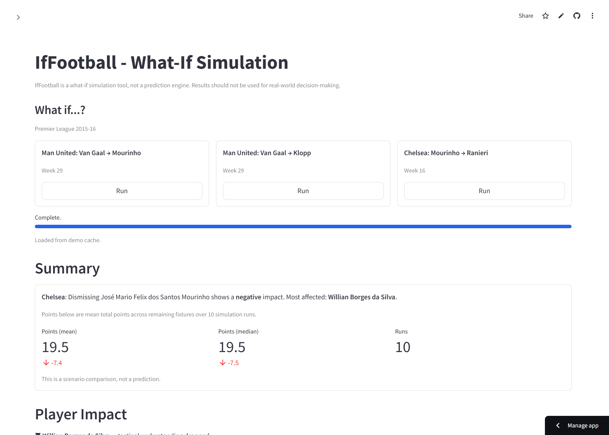
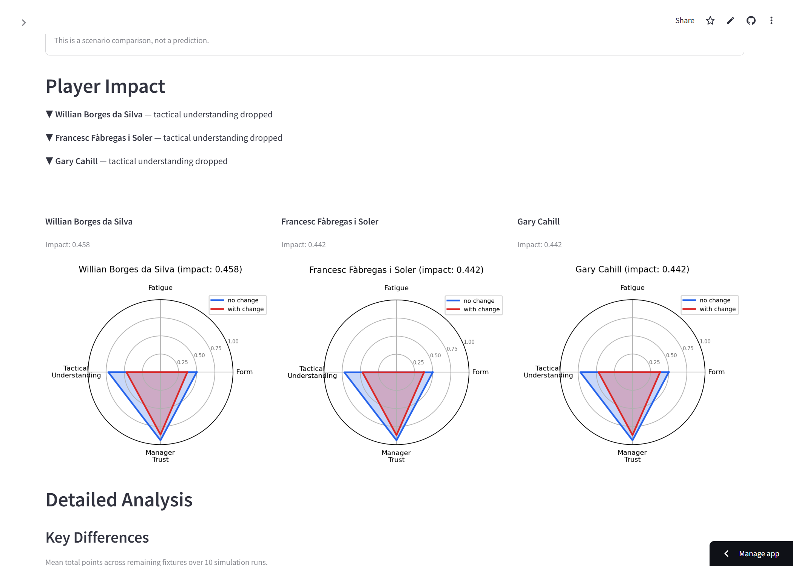

# IfFootball

[English version](README.md)

> _「第 29 節後にファン・ハールが解任されていたら？」_

監督交代や選手移籍がサッカーチームのシーズンにどう影響したかをシミュレートします。StatsBomb Open Data、ルールベースの因果シミュレーション、オプションの LLM 分析レポートを使用。**API キー不要で動作 — LLM はオプションです。**




## クイックスタート

```bash
git clone https://github.com/hryk224/IfFootball.git
cd IfFootball
uv sync --extra dev
uv run streamlit run app.py
```

**Manchester United** を選択し、Current Manager に **Louis van Gaal** と入力、Trigger Week を **29** に設定して **Run Simulation** をクリック。初回実行時は StatsBomb API の取得に 2〜5 分かかります。

`.env` ファイル、API キー、LLM のセットアップなしで基本機能が使えます。

## 出力例

バックテスト: マンチェスター・ユナイテッド — ファン・ハール解任 第 29 節（プレミアリーグ 2015-16、20 回シミュレーション）:

```
Branch A（継続）:  12.2 ポイント（平均）  ±3.5
Branch B（解任）:  12.8 ポイント（平均）  ±3.2
差分 (B - A):      +0.5 ポイント

影響上位 3 名:
  1. Michael Carrick     (impact: 0.683) — 疲労 +0.19, 信頼度 +0.13
  2. Jesse Lingard       (impact: 0.595) — フォーム -0.09, 疲労 -0.15
  3. Ander Herrera       (impact: 0.584) — フォーム -0.12, 戦術理解度 -0.25
```

シミュレーションは微増傾向（+0.5 ポイント）を示しますが、統計的不確実性の範囲内です。全選手が戦術理解度のリセット（-0.25）を経験しており、監督交代後の適応期間を反映しています。Streamlit UI ではレーダーチャートと構造化レポートも含む完全な分析が表示されます。

## 免責事項

IfFootball は **what-if シミュレーションツール**であり、予測エンジンではありません。結果はルールベースのパラメータに基づく理論的な結果であり、実際のイベントの予測ではありません。すべてのシミュレーションパラメータは暫定値であり、根拠とともに [simulation-rules.md](docs/simulation-rules.md#known-limitations) に記載されています。本ソフトウェアまたはその出力に基づいて行われたいかなる判断についても、作者は責任を負いません。

## 主な機能

- **監督交代** — シーズン中の解任をシミュレート。戦術プロファイルのリセット、選手の信頼度再調整、適応曲線を反映
- **選手移籍** _(実験的)_ — 役割に応じた信頼度初期化で選手をスカッドに追加
- **A/B 比較** — Poisson 試合モデル、週次状態更新（疲労・信頼度・戦術理解度）、ターニングポイント検出とカスケードイベント追跡
- **可視化** — Branch A/B を比較するチーム・選手レーダーチャート
- **LLM レポート** — データ / 分析 / 仮説のラベル付き構造化比較レポート
- **Streamlit UI** — 入力からシミュレーション、出力までを一気通貫で操作できるシングルページアプリ

### 動作フロー

```
ユーザー入力（チーム、監督、トリガー節）
    |
    v
StatsBomb データ --> エージェント初期化（選手、監督、チームベースライン）
    |
    v
シミュレーションエンジン（N 回 x 2 ブランチ）
    |--- Branch A: 変化なし
    |--- Branch B: トリガー適用
    |
    v
比較 & 可視化（レーダーチャート、カスケードイベント、レポート）
```

## データソース

IfFootball は [StatsBomb Open Data](https://github.com/statsbomb/open-data) のみを使用します。すべての指標と用語は StatsBomb の定義に準拠しています。スクレイピングは一切行いません。帰属表示と利用条件は [StatsBomb Open Data ライセンス](https://github.com/statsbomb/open-data/blob/master/LICENSE.pdf)に従います。

現在対応しているコンペティション（`config/targets.toml`）:

| コンペティション | シーズン | チーム                                                                                             |
| ---------------- | -------- | -------------------------------------------------------------------------------------------------- |
| プレミアリーグ   | 2015-16  | Manchester United, Manchester City, Arsenal, Liverpool, Chelsea, Tottenham Hotspur, Leicester City |
| ラ・リーガ       | 2015-16  | Real Madrid, Barcelona, Atletico Madrid                                                            |

## 詳細セットアップ

上記のクイックスタートで最小構成は動作します。ここでは開発ツールと LLM の設定を追加します。

```bash
git clone https://github.com/hryk224/IfFootball.git
cd IfFootball
cp .env.example .env
uv sync --extra dev
npm install                    # Markdown フォーマット用（任意）
```

**必要環境:** Python >= 3.11, [uv](https://docs.astral.sh/uv/), Node.js（任意、`npm run format:md` 用のみ）

### LLM セットアップ（任意）

LLM によるレポート生成を有効にするには、プロバイダー SDK をインストールし API キーを設定します:

```bash
uv sync --extra dev --extra llm
```

`.env` に以下のいずれかを設定:

```
OPENAI_API_KEY=sk-...
ANTHROPIC_API_KEY=sk-ant-...
GOOGLE_API_KEY=AI...
GROQ_API_KEY=gsk_...
```

対応プロバイダー: OpenAI, Anthropic, Google Gemini, Groq。LLM 未設定時はデータのみモードで動作し、シミュレーションデータから構造化レポートを生成します。

**モデル指定:** 各プロバイダーに個別のモデル環境変数があります（`OPENAI_MODEL`, `ANTHROPIC_MODEL`, `GEMINI_MODEL`, `GROQ_MODEL`）。未設定時はプロバイダーのデフォルトモデルが使用されます。

**OpenAI 互換 API:** `OPENAI_BASE_URL` を設定すると OpenAI 互換エンドポイント（Azure OpenAI、ローカル推論サーバーなど）を使用できます。

**注意:** LLM 有効時は、シナリオデータ（チーム名、選手名、シミュレーション結果）が設定されたプロバイダーに送信されます。データの取り扱いは各プロバイダーのポリシーに従います。

## 使い方

### Streamlit UI

```bash
uv run streamlit run app.py
```

サイドバーでパラメータ（チーム、監督、トリガー節、シミュレーション設定）を入力し「Run Simulation」をクリック。

### バックテストスクリプト

```bash
uv run python scripts/backtest_van_gaal.py
```

ファン・ハール解任シナリオ（マンチェスター・ユナイテッド、第 29 節、20 回実行）を実行し、結果を `output/backtest_van_gaal/results.json` に出力します。

## 設計方針

- **ルールベースの核** — シミュレーションロジックは設定ファイルで定義。LLM は判断しない。Seeded RNG で再現可能
- **StatsBomb 準拠** — すべての指標は StatsBomb の定義に従う。独自指標は作らない
- **LLM は説明層** — LLM の役割は知識クエリ、行動説明、レポート生成に限定。シミュレーションの判断は行わない
- **透明なパラメータ** — すべてのシミュレーションパラメータは定義・値・根拠とともに [simulation-rules.md](docs/simulation-rules.md) に記載
- **データ / 分析 / 仮説ラベル** — すべての出力でシミュレーションデータ、モデル由来の分析、推測的仮説を区別

## テスト

```bash
uv run python -m pytest        # 554+ テスト
uv run python -m ruff check .  # リンター
uv run python -m mypy .        # 型チェック
```

## ドキュメント

- [Simulation Rules](docs/simulation-rules.md) — 全パラメータの定義と根拠（英語）
- [Changelog](docs/CHANGELOG.md) — マイルストーンごとの変更履歴
- [Contributing](CONTRIBUTING.md) — 開発フローとガイドライン

## ライセンス

[MIT](LICENSE)

## 謝辞

- [StatsBomb](https://statsbomb.com/) — Open Data の提供
- ルールベースのスポーツシミュレーションと LLM 統合を探求する個人プロジェクトとして構築
